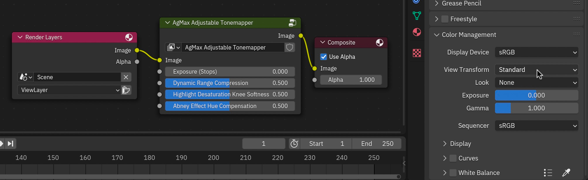
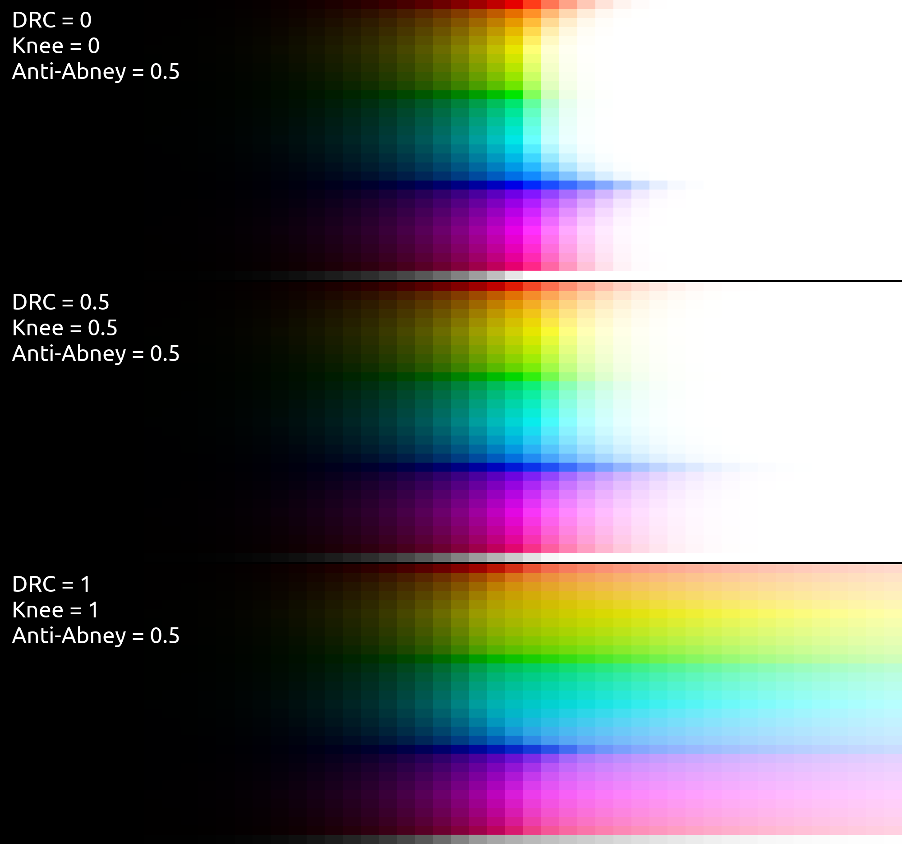
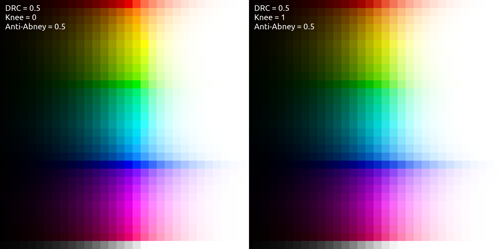
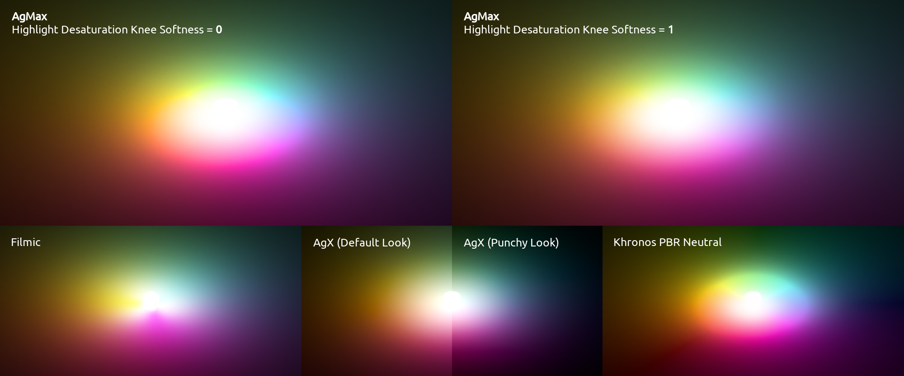
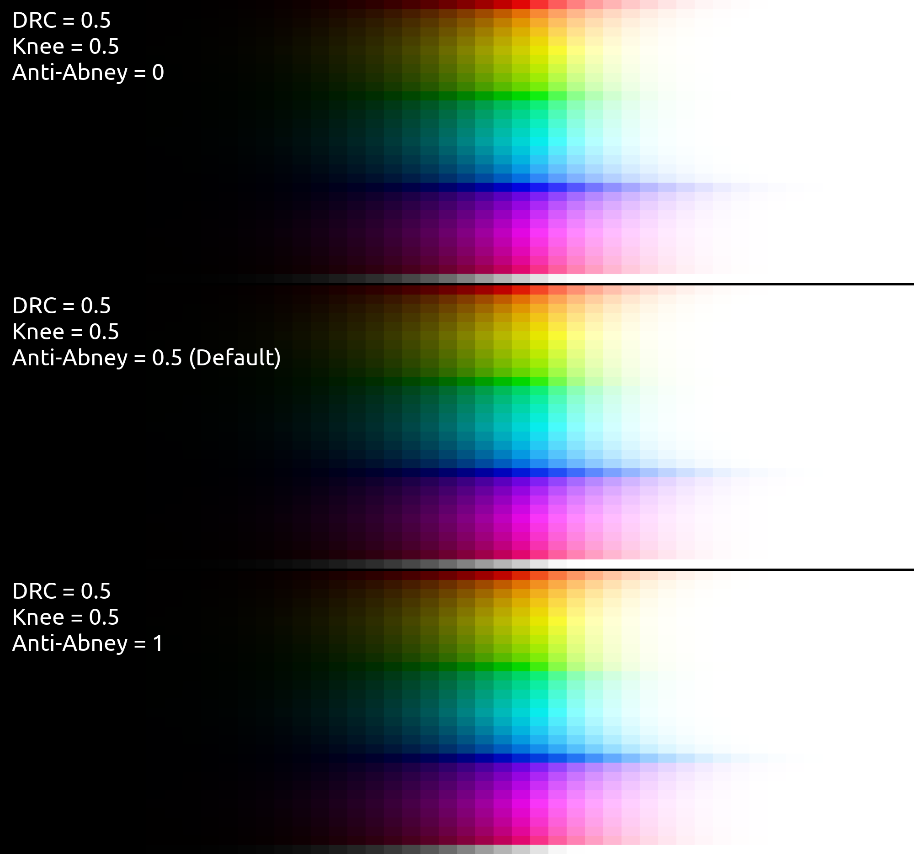

NodeGroup Usage Guide: AgMax
**********

General
==========

This compositor nodegroup is intended to be used with the View Transform (in the Color Management panel) set to the “Standard” option.

Controls
==========

Exposure (Stops)
----------
Adjusts image exposure in `stops <https://photographylife.com/what-are-exposure-stops-in-photography>`_ (occurs prior to highlight desaturation). Works the same as the Exposure slider in Blender’s Color Management panel.

Dynamic Range Compression
----------
Controls how much the bright parts of the input image are reduced in luminosity to include more highlight detail in the output image. Lower values produce more blown-out highlights, and higher values make a softer, less contrasty, look with more colorful highlights.

Highlight Desaturation Knee Softness
----------
Higher values produce visually smoother highlight desaturation behavior in bright, saturated color gradients—slightly sacrificing maximum saturation.

Abney Effect Hue Compensation
----------
The human eye tends to perceive pure RGB blue as a bit purpley when white is mixed with it, pure RGB red as a bit pinkish when white is mixed with it, and pure RGB green as a bit cyanish when white is mixed with it.

This setting controls the extent to which the hues of these colors get adjusted the more whitening-desaturation gets applied to them, compensating for human visual perception.

