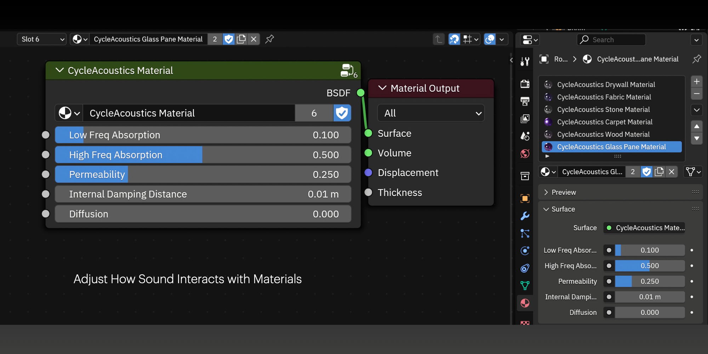

NodeGroup Usage Guide: CycleAcoustics Material
**********

General
=======

This material nodegroup is intended for use with the CycleAcoustics add-on for reverb impulse response generation.

CycleAcoustics Introduction Video
----------
`https://www.youtube.com/watch?v=ryuO1TvM370 <https://www.youtube.com/watch?v=ryuO1TvM370>`_

Controls
========

Low Freq Absorption
-------------------
The proportion of low frequency sound energy **not reflected** off the surface. 0% means that the sound gets reflected at the same intensity as it hit the surface. 100% means no reflection.

High Freq Absorption
-------------------
The proportion of high frequency sound energy **not reflected** off the surface. 0% means that the sound gets reflected at the same intensity as it hit the surface. 100% means no reflection.

Permeability
------------
The proportion of sound energy **transmitted** through the surface upon contact. 0% means the sound is only reflected and never goes through the surface. 100% means the surface is just like air.

Internal Damping Distance
-------------------------
When **leaving** a material (which is when a sound ray passes through a surface with a backfacing normal), a the intensity of a "sound ray" is decreased based on how far the ray traveled in the interior of the material. This is to simulate how the *thicker* a wall is, the less sound can be heard through it. The "internal damping distance" is the distance in Blender Units at which the sound intensity is dampened by 50%. The dampening is exponential.

Diffusion
---------
This setting simulates rough surfaces that scatter sound waves, such as carpets. The typical use case of this setting is when you have flat geometry with a normal map on it that makes it look textured.
